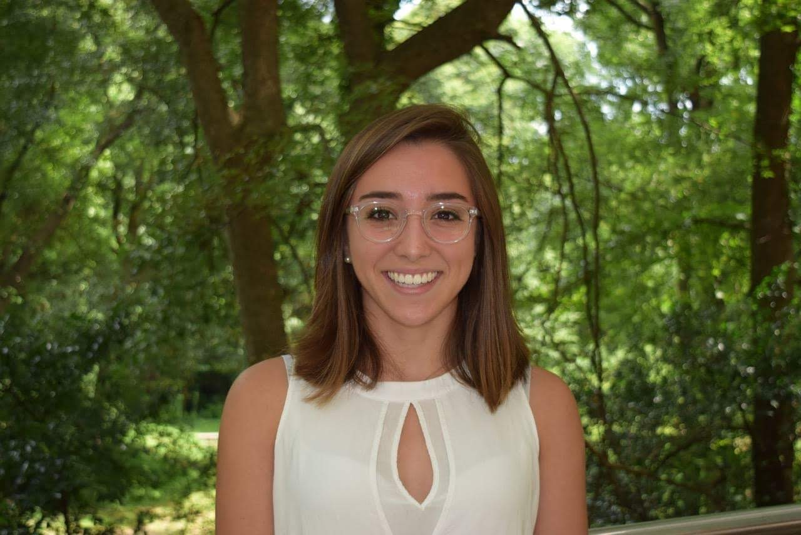

# Hola, I'm Juanita Pardo Sanchez

I was born in Colombia and raised in Atlanta, Georgia. I attended Georgia Tech for my undergraduate degree where I ran D1 cross country and track. I am now a PhD candidate at the University of Michigan working with Elizabeth Tibbetts. When I'm not doing science, I'm likely on a run. 

[My CV](JPSCV_2023_12_08.pdf)
